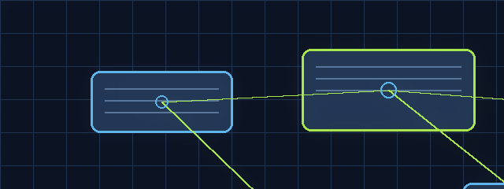

  

<h1 align="center">unstop-scraper</h1>

<strong>Lightweight Python agent that scrapes Unstop for open hackathons, applies deterministic (stage‑1) filters and optional Groq LLM classification, deduplicates using a repo-backed seen.json, and sends Telegram notifications.</strong>

<code>REPO//SIGNAL</code> · <code>BLUEPRINT / SYSTEM</code> · <code>LOOPING README EXPERIENCE</code>

## Live signal

| Lens | Readout |
| --- | --- |
| Portfolio lane | **BLUEPRINT / SYSTEM** |
| Code surface | **20** tracked files observed |
| Primary materials | **Python, YAML, Markdown, JSON** |
| Verification | **0** test-related files observed |

> A structural view of the project machinery. The animated frame above is a lightweight visual signature; the sections below remain the source of truth for implementation details.

## Motion map

`INGEST` → `COMPOSE` → `SHIP`

Trace the repository from inputs and dependencies through its core modules to the delivered surface. Keep configuration explicit, make failure states observable, and add verification around the highest-value paths.

<strong>Open the full project dossier</strong>

## Overview
A modular Python project that scans Unstop for hackathons, applies configurable filters, optionally disambiguates results with a Groq LLM, and notifies a Telegram chat. It supports scheduled runs via the included GitHub Actions workflow and an interactive long‑polling Telegram bot. A small Flask endpoint and Render configuration are included for optional long‑running deployments.

## What it does
- Scrapes Unstop public results and parses hackathon entries (scraper.py).
- Applies stage‑1 deterministic filtering (filter.py) for mode, city, keywords, prize, fee, status, etc.
- Optionally applies stage‑2 classification using Groq LLM for ambiguous items (classifier.py) when an API key is provided.
- Deduplicates results using seen.json (state.py), with TTL cleanup and a 1000-entry cap.
- Sends Telegram messages (notifier.py) with rate limiting and retries; includes an interactive bot mode (bot_check.py).
- Can run on a schedule (GitHub Actions .github/workflows/unstop-hackathon-alert.yml) or as a service (render_app.py, wsgi.py, render.yaml).

## Key capabilities
- Scraping: fetches and parses Unstop hackathon listings.
- Deterministic filters: city, mode (online/offline), keywords, prize, fee, status.
- Optional LLM step: Groq-based classifier for ambiguous items (skips if GROQ_API_KEY absent).
- Deduplication: seen.json persists seen URLs/timestamps and is committed back by the workflow.
- Notifications: Telegram bot + rate-limited sends; interactive commands supported (/start, /filter, check, seen clear).
- Deployment helpers: simple Flask health endpoint and Render service manifest (render.yaml).

## Technology
- Targeted Python 3.11 (referenced in render.yaml / workflow).
- Key packages (requirements.txt):
  - flask
  - requests
  - python-dotenv
  - beautifulsoup4
- Optional/conditional:
  - Playwright (referenced conditionally in scraper.py)
  - Groq LLM (external API; optional)
- Scheduling: GitHub Actions workflow for periodic runs.

## Repository structure
Main files and their responsibilities (non-exhaustive):
- main.py — orchestrates scheduled scans.
- scraper.py — fetches and parses Unstop results.
- filter.py — stage‑1 deterministic filtering rules.
- classifier.py — optional Groq LLM classification for ambiguous items.
- notifier.py — Telegram message formatting, rate limiting and retries.
- bot_check.py — long‑polling interactive Telegram bot.
- state.py — seen.json persistence and TTL cleanup.
- seen.json — committed state file (deduplication history).
- config.py / user_prefs.py — defaults and user filter preferences.
- env_loader.py / env/ — environment loading helpers and env directory.
- get_chat_id.py — helper to extract Telegram chat id.
- render_app.py, wsgi.py, render.yaml — small Flask endpoints and Render manifest.
- requirements.txt — runtime dependencies.
- .github/workflows/unstop-hackathon-alert.yml — scheduled workflow (every 6 hours).

## Getting started
The repository includes an existing README excerpt with local run instructions. Based on repository contents:
- Install dependencies:
  - pip install -r requirements.txt
- The project references env/.env.example in its documentation; there is an env/ directory in the repo (inspect env/ for example env files).
- Example commands found in the repository docs:
  - python get_chat_id.py (to obtain TELEGRAM_CHAT_ID)
  - python main.py (scheduled mode)
  - python bot_check.py (interactive long‑polling bot)

If you follow these steps locally, ensure you populate environment variables (Telegram bot token/chat id, optional Groq keys) as described in the repository docs.

## Configuration
Configuration is driven by environment variables and config.py/user_prefs.py. Variables referenced in repository documentation and manifests include:
- TELEGRAM_BOT_TOKEN (required for sending messages)
- TELEGRAM_CHAT_ID (required for running the interactive bot)
- GROQ_API_KEY (optional — enables LLM classification)
- GROQ_MODEL (optional)
- USE_LLM (optional; e.g., set to 0 to disable)
Inspect config.py, env/, and render.yaml for defaults and how the project expects environment variables to be provided.

## Development and quality notes
- No automated tests or test harness detected in the repository.
- The scheduled GitHub Actions workflow exists to run the agent and commits seen.json back to the repo; there is no separate CI for tests or linting.
- Playwright is referenced conditionally in scraper.py but is not pinned in requirements.txt — runtime behavior may differ if Playwright is required for certain pages.
- seen.json is committed to the repository and grows over time; consider this when evaluating repository size and privacy.
- Logging is used across modules and network calls include timeouts and retry/backoff logic.

## Safety and responsible use
- seen.json contains a persistent history of consumed URLs and is committed to the repository. It is not a secret but may reveal usage/state; consider moving state out of the repo if that is a concern.
- The GitHub Actions workflow has commit permissions to push seen.json back to the repo. If workflow secrets or access are compromised, this could be abused; review least‑privilege settings for Actions if deploying.
- Telegram bot token and TELEGRAM_CHAT_ID are required secrets. The code sets TELEGRAM_CHAT_ID into the environment at runtime in some flows; validate values and restrict who can interact with the bot.
- The optional /trigger or similar manual scan endpoints in render_app.py are unprotected in the current codebase — exposing them publicly without authentication is risky. Inspect render_app.py before deploying it publicly.

## Contributing
- The repository contains clear module boundaries; contributors can inspect and modify scraper.py, filter.py, classifier.py, notifier.py, and state.py.
- To review configuration and runtime behavior, look at:
  - config.py, user_prefs.py
  - env/ (example env files referenced by the in-repo documentation)
  - .github/workflows/unstop-hackathon-alert.yml (scheduling and commit behavior)
  - render.yaml and render_app.py (optional service deployment / health endpoint)
- There are no CONTRIBUTING.md or automated test suites in the repo. If you plan changes that affect state persistence, notification, or secrets handling, prefer small PRs and review seen.json handling carefully.

(There is no license file detected in the repository evidence.)

---

README motion system · visual layer by RepoSignal · implementation details remain project-specific

